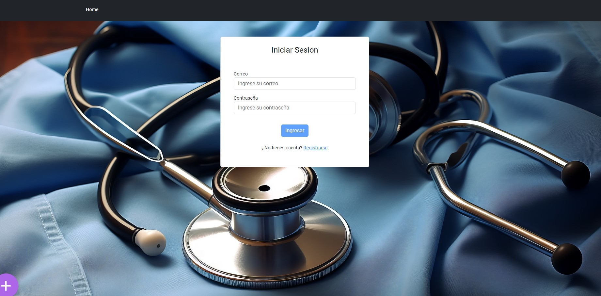
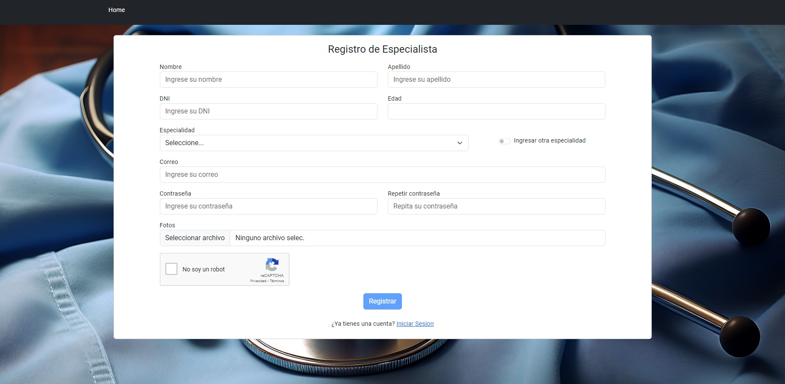

## Home

## Login

## Registro

> Puede elegir registrarse como especialista o paciente.

## Página de registro

## Mi Perfil - Paciente

> Al ingresar como usuario nos redirecciona a 'Mi Perfil'

## Paciente

# Agendar Turno - Especialidad

1. Se elige una especialidad

# Agendar Turno - Especialista

2. Se elige una especialista

# Agendar Turno - Fecha

2. Se elige una fecha

## Mi Perfil - Especialista

> Al ingresar como usuario nos redirecciona a 'Mi Perfil'

# Agregar horario

1. Como especialista se puede agregar un horario

